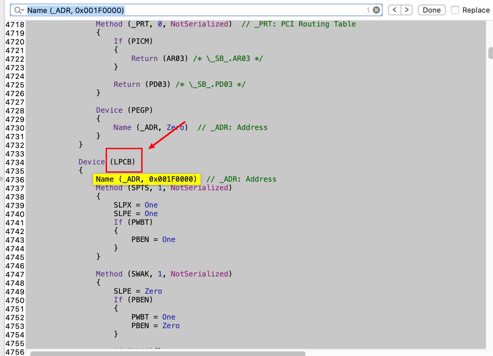
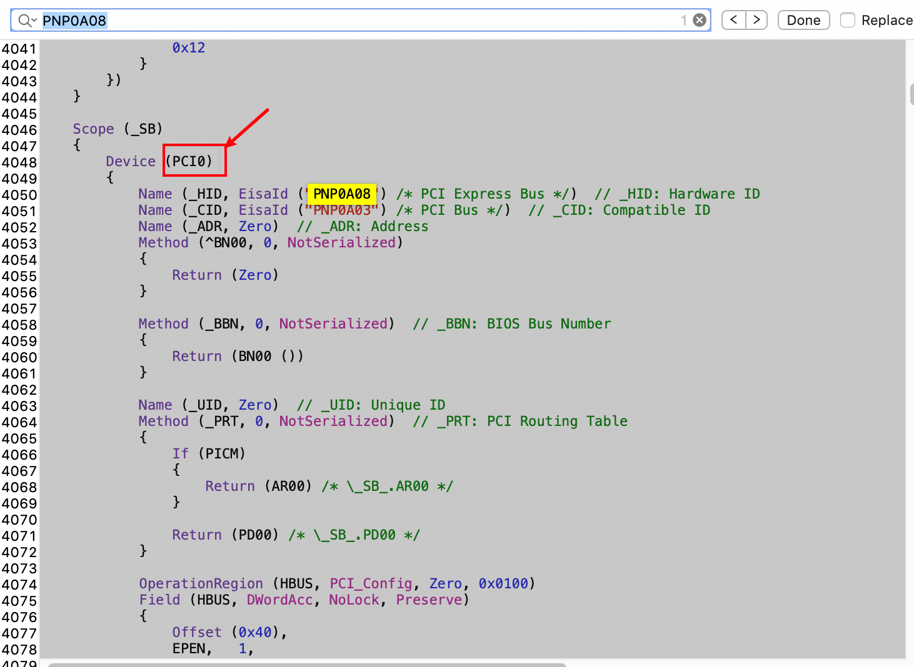
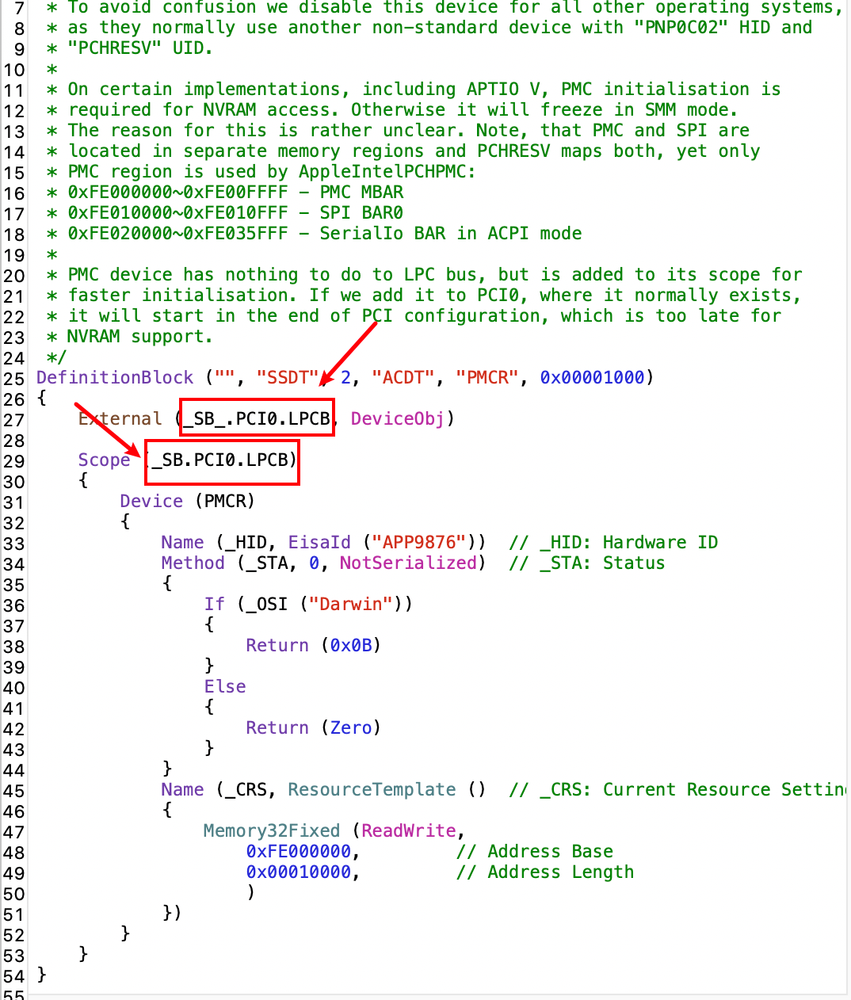
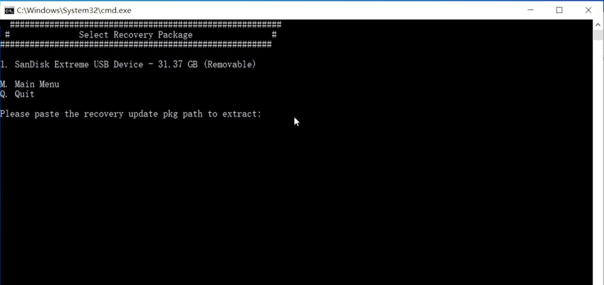

# Hackintosh_Z390_9700K_OpenCore

> 我会以windows平台为例,详细讲解OpenCore的配置过程,若有和我电脑相似配置且无从下手的小伙伴,可按照此教程来进行操作

---

### 第一节:配置SSDT与提取DSDT

1. 安装配置环境
   * [7z](https://cloud.upchome.cn:3301/#/s/XVIJ)
   * [python3](https://cloud.upchome.cn:3301/#/s/NkFJ)
   * 下载上面两个软件并安装.Python安装时需要注意将Add Python 3.8 to PATH 勾选上
2. 提取DSDT
   * 下载[SSDTTime](https://cloud.upchome.cn:3301/#/s/k2c8),解压-双击打开SSDTTime.bat-选择4,Dump DSDT
   * 当前文件夹下Results目录会生成DSDT.aml文件,此时DSDT提取完毕
3. 反编译DSDT
   * 下载[iasl](https://cloud.upchome.cn:3301/#/s/3KU3),解压文件
   * 将自己的DSDT.aml文件放在iasl文件夹下
   * 执行```iasl dsdt.aml```,会生成DSDT.dsl文件,此文件为反编译的DSDT文件,可用notepad++等文本编辑器软件打开查看
   * asl是已编译文件,dsl是未编译文件,请知晓
4. 创建所需SSDT
   * coffeeLake平台所需基本SSDT文件大致有以下5个,分别为SSDT-PLUG,SSDT-EC,SSDT-USBX,SSDT-AWAC,SSDT-PMC
   * 双击打开SSDTTime.bat,选择2创建SSDT-EC;选择3,创建SSDT-PLUG,文件保存在Results目录下
   * 生成自己的SSDT-AWC,由于本人主板(技嘉Z390 PRO WIFI)不需要此文件,在此向各位提供相关[教程链接](https://dortania.github.io/Getting-Started-With-ACPI/Universal/awac.html),完成上述步骤后对自己的dsl文件进行编译,具体方法是将文件放到iasl文件夹下,执行 ```iasl 文件名.dsl```
   * 创建SSDT-PMC,此文件用于开启NVRAM的支持,Z370主板不需要此文件,[SSDT-PMC.aml](https://github.com/dortania/Getting-Started-With-ACPI/blob/master/extra-files/SSDT-PMC.aml)下载官方提供的aml文件,使用iasl程序对其进行反编译(上面已叙述操作方法,不再复述),打开DSDT.dsl,依次搜索```Name (_ADR, 0x001F0000)```   ```PNP0A08```,,,打开SSDT-PMC.dsl,,根据实际情况对这两处进行修改,修改完成后再通过iasl软件编译为aml文件即可
   * [SSDT-USBX.aml](https://cloud.upchome.cn:3301/#/s/o9s5)通用文件,直接下载使用即可
   * 此时我们新建文件夹,将上述步骤生成的aml文件放到这个文件夹内(不包括DSDT.aml)

### 第二节:创建恢复U盘

1. 下载[gibMacOS](https://cloud.upchome.cn:3301/#/s/15tA),解压,双击打开gibMacOS.bat,按```R```切换至恢复模式镜像,输入数字下载带有```FULL Install```最新的镜像包,镜像包会下载至当前文件夹下的```macOS Downloads```文件夹下,是一个pkg文件,复制这个文件的路径待用
2. 插上U盘,在gibMacOS目录下双击打开Makeinstall.bat,在窗口上面会显示已插入的U盘,需要输入**U盘编号+O**(例如U盘编号为3 : ```3O```),按照提示操作
3. 到这个步骤输入上一步复制的文件路径,然后回车,等待完成
4. 此时电脑上会有一个BOOT的盘符,里面有一个EFI文件夹,删除掉EFI文件夹,用这个[EFI下载](https://cloud.upchome.cn:3301/#/s/M2ig)文件夹替换,将我们自己生成的SSDT文件放入ACPI文件夹内

### 第三节:选择硬件驱动

1. 有线网卡与无线网卡驱动,技嘉Z390 PRO WIFI主板有线网卡驱动为Intel i219,无线网卡无法驱动,已自行购买**BCM94360cs2**,此款免驱无需驱动文件,同款主板有线网卡驱动可[点此下载](https://cloud.upchome.cn:3301/#/s/v3C6)
2. 无线修复驱动,修复睡眠后无线网卡掉速问题,[AirportBrcmFixup](https://cloud.upchome.cn:3301/#/s/B2hA)
3. USB修复,[USBInjectAll](https://cloud.upchome.cn:3301/#/s/9kTW)
4. 将驱动文件解压放入**Kexts**文件夹内

### 第四节:根据底包生成自己的config.plist文件

* 下载[OpenCore(0.5.8)](https://cloud.upchome.cn:3301/#/s/KvH1)源码,解压,复制Docs文件夹下的```Sample.plist```至EFI根目录并重命名为```cofig.plist```
* 下载[ProperTree](https://cloud.upchome.cn:3301/#/s/ZDfZ),解压后双击```ProperTree.bat```,在窗口左上角选择打开config.plist
* 按```ctrl + shift + r```,选择BOOT盘符下的EFI文件夹下的OC文件夹,选择此文件夹,此时ProperTree会根据OC目录下的SSDT以及驱动文件帮助完善config相关的配置(也就是将我们的SSDT补丁和驱动文件都导入到config配置文件里,使其生效)

* 接下来不同主板的配置方法不同,给大家提供几个配置的参考链接,供参考.[参考链接1](https://dortania.github.io/OpenCore-Desktop-Guide/config.plist/coffee-lake.html),[参考链接2](https://blog.xjn819.com/)
* 我的[config.plist](https://cloud.upchome.cn:3301/#/s/GWuA)
* 启动参数中加上-v,便于排错

### 第五节:设置主板Bois

* 如图所示
* 

### 第六节:测试自己的引导文件

* 开机按```F12```,选择OpenCore U盘引导启动,选择安装macOS,如果我们可以进入安装界面则证明引导文件可正常使用,若出现问题请根据实际情况排查原因,请善用搜索引擎
* 使用另一个U盘安装PE系统,进入PE系统后使用DG磁盘工具对我们要安装的磁盘删除所有分区,然后创建一个ESP分区,大小为200MB,具体操作不再赘述,善用搜索引擎
* 使用我们的引导U盘进入安装界面,进行系统安装

### 第七节:系统安装

* 连上无线局域网

* 下一步 -> 下一步 -> ... -> 等待安装完成

### 第八节:安装后的完善

### 第九节:设置Bootcamp
